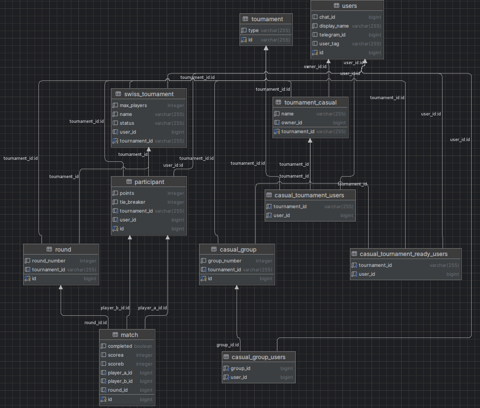

# ER и даталогическая модель (PostgreSQL)

Документ фиксирует ER-модель, даталогическую модель и DDL/триггеры/функции/индексы для текущей системы (швейцарские и казуальные турниры через Telegram-бот). Новых сущностей сверх существующих доменных не вводится; в ER учтены ассоциативные таблицы.

## 1. ER-модель (минимум 10 сущностей, есть M:N)
Сущности:
1. **Tournament** — базовый турнир (тип: SWISS/CASUAL).
2. **SwissTournament** — детали швейцарки (1:1 к Tournament).
3. **TournamentCasual** — детали казуала (1:1 к Tournament).
4. **User** — игрок/владелец.
5. **Participant** — участие игрока в SwissTournament (User–SwissTournament, 1:N).
6. **Round** — раунды швейцарки (SwissTournament–Round, 1:N).
7. **Match** — матчи в раундах (Round–Match, 1:N; Match–Participant: игроки A/B).
8. **CasualGroup** — группы в казуале (TournamentCasual–CasualGroup, 1:N).
9. **CasualTournamentUsers** — M:N TournamentCasual–User (участники казуала).
10. **CasualTournamentReadyUsers** — M:N TournamentCasual–User (готовые игроки).
11. **CasualGroupUsers** — M:N CasualGroup–User (игроки в группе).

Связи M:N: три ассоциативные сущности (9–11). Остальные связи: Tournament↔SwissTournament (1:1), Tournament↔TournamentCasual (1:1), SwissTournament↔Participant (1:N), Participant↔Round↔Match (1:N), TournamentCasual↔CasualGroup (1:N).

## 2. Даталогическая модель (основные поля)
- **tournament**(id PK, type ENUM('SWISS','CASUAL'))
- **swiss_tournament**(tournament_id PK/FK, name, owner_id FK users, max_players, status ENUM('REGISTRATION','IN_PROGRESS','COMPLETED'))
- **tournament_casual**(tournament_id PK/FK, name, owner_id FK users)
- **users**(id PK, user_tag, telegram_id UNIQUE, display_name NOT NULL, chat_id)
- **participant**(id PK, user_id FK users, tournament_id FK swiss_tournament, points DEFAULT 0, tiebreaker DEFAULT 0, UNIQUE(user_id, tournament_id))
- **round**(id PK, tournament_id FK swiss_tournament, round_number, UNIQUE(tournament_id, round_number))
- **match**(id PK, round_id FK round, player_a_id FK participant, player_b_id FK participant, score_a, score_b, completed BOOL DEFAULT false)
- **tournament_casual_users**(tournament_id FK, user_id FK, PK(tournament_id, user_id))
- **tournament_casual_ready_users**(tournament_id FK, user_id FK, PK(tournament_id, user_id))
- **casual_group**(id PK, tournament_id FK tournament_casual, group_number, UNIQUE(tournament_id, group_number))
- **casual_group_users**(group_id FK, user_id FK, PK(group_id, user_id))

## 3. DDL (PostgreSQL, с ограничениями целостности)
```sql
-- Типы
CREATE TYPE tournament_type_enum AS ENUM ('SWISS','CASUAL');
CREATE TYPE tournament_status_enum AS ENUM ('REGISTRATION','IN_PROGRESS','COMPLETED');

-- Базовый турнир
CREATE TABLE tournament (
    id              VARCHAR(12) PRIMARY KEY,
    type            tournament_type_enum NOT NULL
);

-- Пользователи
CREATE TABLE users (
    id              BIGSERIAL PRIMARY KEY,
    user_tag        VARCHAR(64),
    telegram_id     BIGINT UNIQUE,
    display_name    VARCHAR(128) NOT NULL,
    chat_id         BIGINT
);

-- Швейцарский турнир
CREATE TABLE swiss_tournament (
    tournament_id   VARCHAR(12) PRIMARY KEY REFERENCES tournament(id) ON DELETE CASCADE,
    name            VARCHAR(255) NOT NULL,
    owner_id        BIGINT REFERENCES users(id),
    max_players     INT NOT NULL CHECK (max_players > 1),
    status          tournament_status_enum NOT NULL DEFAULT 'REGISTRATION'
);

-- Казуальный турнир
CREATE TABLE tournament_casual (
    tournament_id   VARCHAR(12) PRIMARY KEY REFERENCES tournament(id) ON DELETE CASCADE,
    name            VARCHAR(255) NOT NULL,
    owner_id        BIGINT REFERENCES users(id)
);

-- Участники швейцарки
CREATE TABLE participant (
    id              BIGSERIAL PRIMARY KEY,
    user_id         BIGINT NOT NULL REFERENCES users(id),
    tournament_id   VARCHAR(12) NOT NULL REFERENCES swiss_tournament(tournament_id) ON DELETE CASCADE,
    points          INT NOT NULL DEFAULT 0,
    tiebreaker      INT NOT NULL DEFAULT 0,
    UNIQUE (user_id, tournament_id)
);

-- Раунды
CREATE TABLE round (
    id              BIGSERIAL PRIMARY KEY,
    tournament_id   VARCHAR(12) NOT NULL REFERENCES swiss_tournament(tournament_id) ON DELETE CASCADE,
    round_number    INT NOT NULL,
    UNIQUE (tournament_id, round_number)
);

-- Матчи
CREATE TABLE match (
    id              BIGSERIAL PRIMARY KEY,
    round_id        BIGINT NOT NULL REFERENCES round(id) ON DELETE CASCADE,
    player_a_id     BIGINT REFERENCES participant(id),
    player_b_id     BIGINT REFERENCES participant(id),
    score_a         INT,
    score_b         INT,
    completed       BOOLEAN NOT NULL DEFAULT false,
    CHECK ( (score_a IS NULL AND score_b IS NULL) OR (score_a BETWEEN 0 AND 2 AND score_b BETWEEN 0 AND 2) )
);

-- Казуал: участники (M:N)
CREATE TABLE tournament_casual_users (
    tournament_id   VARCHAR(12) NOT NULL REFERENCES tournament_casual(tournament_id) ON DELETE CASCADE,
    user_id         BIGINT NOT NULL REFERENCES users(id),
    PRIMARY KEY (tournament_id, user_id)
);

-- Казуал: готовые участники (M:N)
CREATE TABLE tournament_casual_ready_users (
    tournament_id   VARCHAR(12) NOT NULL REFERENCES tournament_casual(tournament_id) ON DELETE CASCADE,
    user_id         BIGINT NOT NULL REFERENCES users(id),
    PRIMARY KEY (tournament_id, user_id)
);

-- Казуал: группы
CREATE TABLE casual_group (
    id              BIGSERIAL PRIMARY KEY,
    tournament_id   VARCHAR(12) NOT NULL REFERENCES tournament_casual(tournament_id) ON DELETE CASCADE,
    group_number    INT NOT NULL,
    UNIQUE (tournament_id, group_number)
);

-- Казуал: игроки в группах (M:N)
CREATE TABLE casual_group_users (
    group_id        BIGINT NOT NULL REFERENCES casual_group(id) ON DELETE CASCADE,
    user_id         BIGINT NOT NULL REFERENCES users(id),
    PRIMARY KEY (group_id, user_id)
);
```

## 4. Триггеры (целостность бизнес-правил)
```sql
-- 4.1 Ограничить число участников швейцарки max_players
CREATE OR REPLACE FUNCTION trg_participant_limit()
RETURNS TRIGGER AS $$
BEGIN
  IF (SELECT COUNT(*) FROM participant WHERE tournament_id = NEW.tournament_id) >=
     (SELECT max_players FROM swiss_tournament WHERE tournament_id = NEW.tournament_id) THEN
     RAISE EXCEPTION 'Max players exceeded for tournament %', NEW.tournament_id;
  END IF;
  RETURN NEW;
END;$$ LANGUAGE plpgsql;

CREATE TRIGGER participant_limit
BEFORE INSERT ON participant
FOR EACH ROW EXECUTE FUNCTION trg_participant_limit();

-- 4.2 Валидация счёта BO3 и установка completed
CREATE OR REPLACE FUNCTION trg_match_score_validate()
RETURNS TRIGGER AS $$
DECLARE
  sA INT := NEW.score_a;
  sB INT := NEW.score_b;
BEGIN
  IF sA IS NOT NULL AND sB IS NOT NULL THEN
    IF NOT ( (sA = 2 AND sB IN (0,1)) OR (sB = 2 AND sA IN (0,1)) OR (sA = 1 AND sB = 1) ) THEN
      RAISE EXCEPTION 'Invalid BO3 score %, %', sA, sB;
    END IF;
    NEW.completed := TRUE;
  END IF;
  RETURN NEW;
END;$$ LANGUAGE plpgsql;

CREATE TRIGGER match_score_validate
BEFORE INSERT OR UPDATE ON match
FOR EACH ROW EXECUTE FUNCTION trg_match_score_validate();

-- 4.3 Уникальность участника швейцарки по user_id + tournament_id обеспечена UNIQUE; триггер не нужен.
```

## 5. Скрипты создания/удаления/наполнения
```sql
-- create_db.sql
CREATE DATABASE edh_tgbot;
\c edh_tgbot;
-- (выполнить DDL выше)

-- drop_db.sql
DROP DATABASE IF EXISTS edh_tgbot;

-- seed.sql (пример тестовых данных)
INSERT INTO users (user_tag, telegram_id, display_name, chat_id) VALUES
 ('alice', 1001, 'Alice', 5001),
 ('bob',   1002, 'Bob',   5002),
 ('carol', 1003, 'Carol', 5003),
 ('dave',  1004, 'Dave',  5004);

INSERT INTO tournament (id, type) VALUES ('SWISS001', 'SWISS');
INSERT INTO swiss_tournament (tournament_id, name, owner_id, max_players, status)
VALUES ('SWISS001', 'Friday Night Magic', 1, 8, 'REGISTRATION');

INSERT INTO participant (user_id, tournament_id) VALUES (1, 'SWISS001'), (2, 'SWISS001'), (3, 'SWISS001');
INSERT INTO round (tournament_id, round_number) VALUES ('SWISS001', 1);
INSERT INTO match (round_id, player_a_id, player_b_id, score_a, score_b, completed)
VALUES (1, 1, 2, 2, 1, true);

INSERT INTO tournament (id, type) VALUES ('CAS001', 'CASUAL');
INSERT INTO tournament_casual (tournament_id, name, owner_id) VALUES ('CAS001', 'Casual Night', 2);
INSERT INTO tournament_casual_users VALUES ('CAS001', 1), ('CAS001', 3), ('CAS001', 4);
INSERT INTO tournament_casual_ready_users VALUES ('CAS001', 1), ('CAS001', 3);
INSERT INTO casual_group (tournament_id, group_number) VALUES ('CAS001', 1);
INSERT INTO casual_group_users VALUES (1, 1), (1, 3);
```

## 6. PL/pgSQL функции/процедуры (критические операции)
```sql
-- Добавить участника в швейцарку с проверкой лимита и уникальности
CREATE OR REPLACE FUNCTION add_participant_swiss(p_tournament_id VARCHAR, p_user_id BIGINT)
RETURNS VOID AS $$
BEGIN
  INSERT INTO participant(user_id, tournament_id)
  VALUES (p_user_id, p_tournament_id);
END;$$ LANGUAGE plpgsql;

-- Зафиксировать результат матча BO3 и обновить completed
CREATE OR REPLACE FUNCTION submit_match_result(p_match_id BIGINT, p_score_a INT, p_score_b INT)
RETURNS VOID AS $$
BEGIN
  UPDATE match
     SET score_a = p_score_a,
         score_b = p_score_b,
         completed = TRUE
   WHERE id = p_match_id;
END;$$ LANGUAGE plpgsql;

-- Пример выборки таблицы (без полноценных тай-брейков, которые считаются в сервисе)
CREATE OR REPLACE FUNCTION get_standings(p_tournament_id VARCHAR)
RETURNS TABLE(participant_id BIGINT, points INT, tiebreaker INT) AS $$
BEGIN
  RETURN QUERY
  SELECT id, points, tiebreaker
  FROM participant
  WHERE tournament_id = p_tournament_id
  ORDER BY points DESC, tiebreaker DESC, id ASC;
END;$$ LANGUAGE plpgsql;
```

## 7. Индексы (по используемым прецедентам)
```sql
-- Быстрый поиск по Telegram ID пользователя
CREATE INDEX idx_users_telegram_id ON users(telegram_id);

-- Раунды по турниру и номеру
CREATE INDEX idx_round_tournament_round ON round(tournament_id, round_number);

-- Матчи по раунду
CREATE INDEX idx_match_round ON match(round_id);


```
**Обоснование:**
- быстрый поиск пользователя по telegram_id.
- частые выборки участников/таблицы/пар по tournament_id.

---
Документ можно согласовать и использовать как базу для миграций. При необходимости функции тай-брейков можно вынести в SQL/PLpgSQL, но в текущем приложении они рассчитываются на уровне сервисов.
